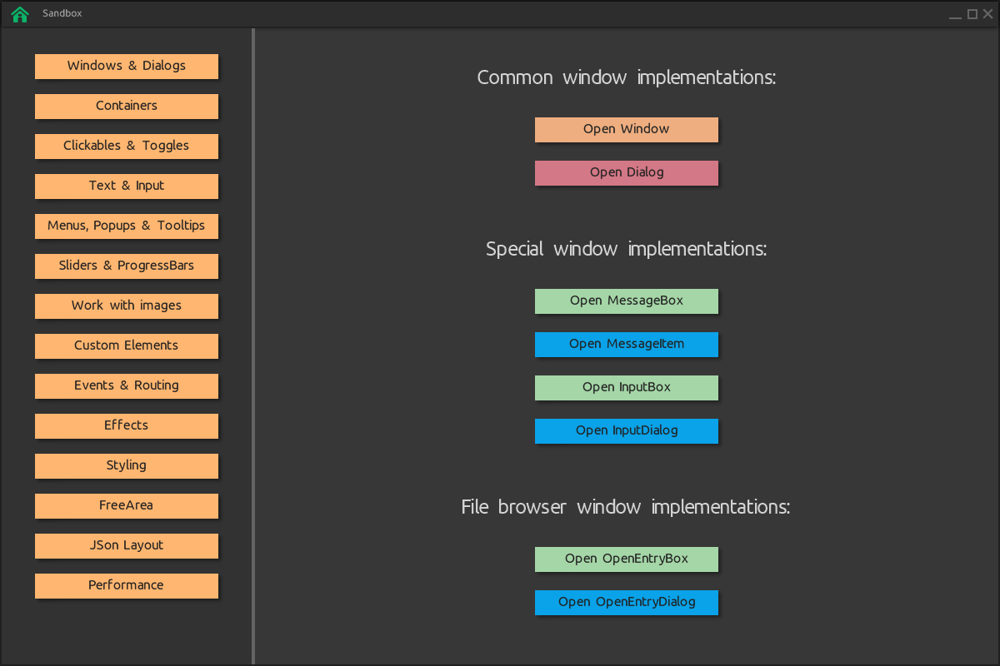

# SpaceVIL
**[SpaceVIL](http://spvessel.com/index.html)** (Space of Visual Items Layout) is a cross-platform and multilingual framework for **creating GUI client applications for .NET Standard, .NET Core and JVM**. SpaceVIL is based on **OpenGL** graphic technology and [glfw](https://www.glfw.org). Using this framework in conjunction with .Net Core or with a JVM, you can work and create graphical client applications on Linux, Mac OS X and Windows.

See more on youtube channel - https://youtu.be/kJ6n1fTHXws

Official web site - http://spvessel.com.

Repository for .Net version of SpaceVIL - https://github.com/spvessel/SpaceVILSharp

## How to compile SpaceVIL for .Net Core

Steps:

1. Download and install any `JDK 18`:

2. Download and install `CMake` (minimum required version - 3.6) for you OS according to the instructions - https://cmake.org/install/

3. Download and install the dependencies that are required to work with `CMake`, for example:

    **Windows OS** - [MS Visual Studio](https://visualstudio.microsoft.com) or [Build Tools for Visual Studio](https://visualstudio.microsoft.com/downloads/)

    **Mac OS** - Xcode Command Line Tools

4. Compile SpaceVIL via terminal:

```
# Windows OS:

> cd spacevil
> compile-win.bat
```

```
# Mac OS:

> cd spacevil
> compile-mac.sh
```


```
# Linux OS:

> cd spacevil
> compile-lin.sh
```

4. After compilation, you can see `com.spvessel.spacevil` `jar` artifact in your local maven repo `.m2/`.


## How to run `sanbox` SpaceVIL example

Steps:

1. After compilation steps you can go to `/sandbox` directory and run example in terminal:

```
# from the root directory of the repository

> cd sandbox
```

```
# Windows OS

> run.bat
```

```
# Mac OS and Linux OS

> run.sh
```


2. If the example run was successful, you will see the window:




### Authors
* **Roman Sedaikin**
* **Valeriia Sedaikina**


### License

Examples is licensed under the MIT License. See the LICENSE.md file for details.
